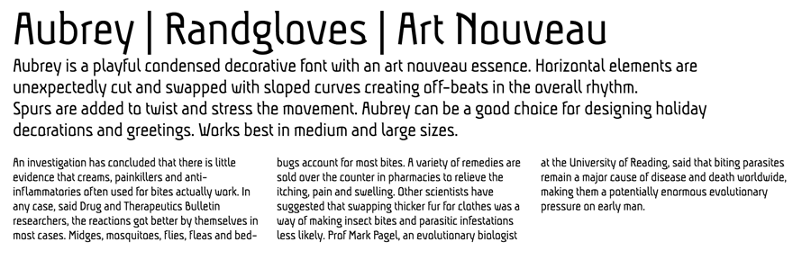

Aubrey is a playful condensed decorative font with an art nouveau essence. Horizontal elements are unexpectedly cut and swapped with sloped curves creating off-beats in the overall rhythm. Spurs are added to twist and stress the movement. Aubrey can be a good choice for designing holiday decorations and greetings. Works best in medium and large sizes.

Designed by Gayaneh Bagdasaryan.

